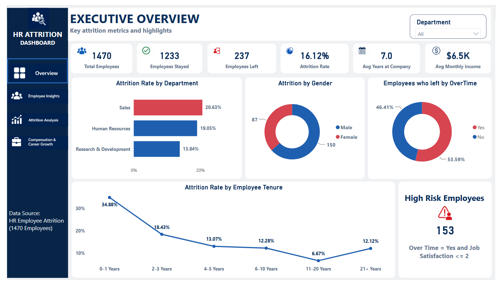
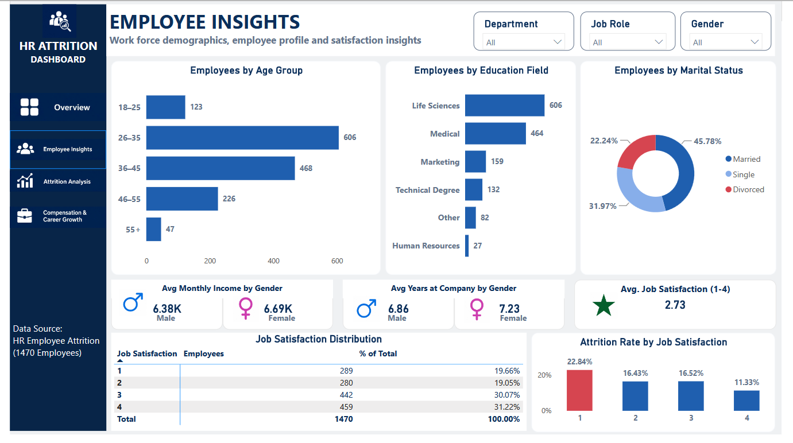
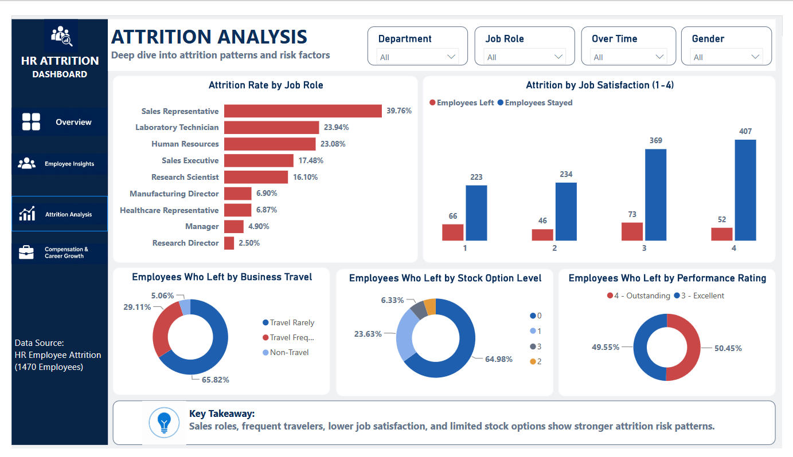
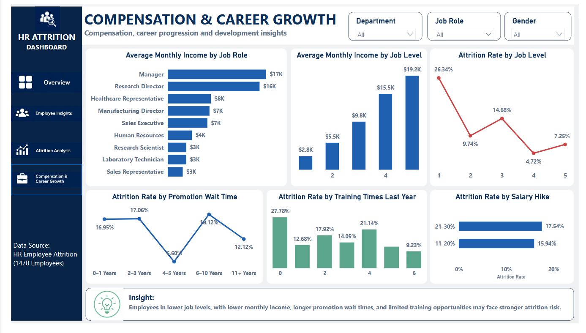

# HR Employee Attrition Analysis

End-to-end HR Employee Attrition Analysis using Excel, SQL Server, and Power BI to uncover workforce trends, attrition risks, compensation patterns, and retention insights.

---

## Project Overview

Employee attrition can affect productivity, workforce stability, recruitment costs, and business performance. This project analyses employee-level HR data to identify attrition patterns, workforce risk factors, compensation trends, and areas for retention improvement.

The analysis was completed using:

- Excel for data cleaning and preliminary analysis
- SQL Server Management Studio for structured SQL analysis
- Power BI for interactive dashboard reporting
- GitHub for project documentation and portfolio presentation

---

## Business Questions

This project answers the following questions:

1. What is the overall employee attrition rate?
2. Which departments and job roles have the highest attrition?
3. How does attrition differ by job satisfaction, overtime, gender, business travel, and stock option level?
4. Do employees who leave earn less on average than employees who stay?
5. Which job roles have the highest and lowest average tenure?
6. How do job level, promotion wait time, training frequency, and salary-hike groups relate to attrition?

---

## Tools Used

| Tool | Purpose |
|---|---|
| Excel | Data cleaning, `COUNTIFS`, pivot analysis, and high-risk employee flagging |
| SQL Server Management Studio | Aggregation, conditional counts, subqueries, and tenure ranking |
| Power BI | Interactive dashboards, DAX measures, calculated columns, slicers, and navigation |
| GitHub | Project documentation and portfolio presentation |

---

## Dataset

The project uses the IBM HR Employee Attrition dataset.

- Total employee records: **1,470**
- Dataset includes employee demographics, department, job role, income, overtime, satisfaction, tenure, promotion history, training, and attrition status.
- Target outcome: employee attrition.

---

## Data Cleaning and Preparation

The following data-cleaning steps were completed before analysis:

- Checked all **1,470 records** for missing values.
- Confirmed that there were no exact duplicate rows.
- Trimmed unnecessary spaces from text fields.
- Standardised column names into lowercase snake_case format.
- Standardised business travel labels for consistency.
- Validated numeric columns for analysis readiness.
- Removed non-informative constant columns:
  - `employee_count`
  - `over18`
  - `standard_hours`
- Created analysis-ready binary fields:
  - `attrition_flag` — Yes = 1, No = 0
  - `overtime_flag` — Yes = 1, No = 0
- Created a high-risk employee rule:

```text
OverTime = Yes AND Job Satisfaction <= 2
```

The cleaned dataset contains **1,470 rows and 34 columns**.

---

## Excel Analysis

Excel was used to complete the following analysis tasks:

- Attrition rate by department using `COUNTIFS`
- Job Role versus Job Satisfaction cross-tab analysis
- High-risk employee identification using nested `IF` and `AND`
- Department attrition-rate summary
- Employee-level risk categorisation

### High-Risk Employee Rule

```excel
=IF(AND(OverTime="Yes", JobSatisfaction<=2), "High Risk", "Standard Risk")
```

A total of **153 employees** were identified as high risk based on overtime status and low job satisfaction.

---

## SQL Analysis

The SQL analysis was completed in SQL Server Management Studio using the cleaned HR attrition table.

### Task 1: Attrition Rate by Department and Job Role

`GROUP BY` and conditional counts were used to calculate attrition rate:

```text
Attrition Rate = Employees Left / Total Employees * 100
```

| Department | Job Role | Attrition Rate |
|---|---|---:|
| Sales | Sales Representative | **39.76%** |
| Research & Development | Laboratory Technician | **23.94%** |
| Human Resources | Human Resources | **23.08%** |
| Sales | Sales Executive | **17.48%** |
| Research & Development | Research Scientist | **16.10%** |

### Task 2: Average Monthly Income — Employees Who Left vs Stayed

Subqueries were used to compare average monthly income.

| Employee Group | Average Monthly Income |
|---|---:|
| Employees who left | **4,787.09** |
| Employees who stayed | **6,832.74** |

Employees who remained with the organisation had a higher average monthly income than employees who left.

### Task 3: Job Role Tenure Ranking

`DENSE_RANK()` was used to rank job roles by average years at the company.

| Rank | Job Role | Average Years at Company |
|---:|---|---:|
| 1 | Manager | **14.43** |
| 2 | Research Director | **10.94** |
| 3 | Healthcare Representative | **8.37** |
| 4 | Manufacturing Director | **7.60** |
| 5 | Sales Executive | **7.50** |
| 6 | Human Resources | **5.33** |
| 7 | Research Scientist | **5.11** |
| 8 | Laboratory Technician | **5.02** |
| 9 | Sales Representative | **2.92** |

Sales Representatives had the shortest average tenure and the highest attrition rate, making this role a major workforce-risk area.

---

## Power BI Dashboard

The Power BI report contains four interactive dashboard pages with slicers and navigation buttons.

### 1. Executive Overview

Highlights high-level workforce and attrition metrics:

- Total Employees: **1,470**
- Employees Stayed: **1,233**
- Employees Left: **237**
- Overall Attrition Rate: **16.12%**
- Average Years at Company: **7.0**
- Average Monthly Income: **$6.5K**
- High-Risk Employees: **153**



### 2. Employee Insights

Explores workforce demographics and employee profile patterns:

- Employees by age group
- Education field distribution
- Marital-status distribution
- Average monthly income by gender
- Average years at company by gender
- Average job satisfaction
- Job-satisfaction distribution
- Attrition rate by job satisfaction



### 3. Attrition Analysis

Focuses on employee-exit risk factors:

- Attrition rate by job role
- Employees who left versus stayed by job satisfaction
- Employees who left by business travel
- Employees who left by stock option level
- Employees who left by performance rating



### 4. Compensation and Career Growth

Examines compensation, development, and career progression patterns:

- Average monthly income by job role
- Average monthly income by job level
- Attrition rate by job level
- Attrition rate by promotion wait time
- Attrition rate by training frequency
- Attrition rate by salary-hike group



---

## Key Insights

- The overall employee attrition rate is **16.12%**.
- The **Sales department** has the highest departmental attrition rate at **20.63%**.
- **Sales Representatives** have the highest attrition rate at **39.76%** and the lowest average tenure at **2.92 years**.
- Employees with lower job-satisfaction ratings show higher attrition rates.
- Overtime is an important workforce-risk indicator, especially when combined with low job satisfaction.
- Employees who left earned approximately **$2,045 less** on average per month than employees who stayed.
- Lower job levels show higher attrition, while compensation rises steadily with job level.
- Attrition differs across promotion-wait, training-frequency, stock-option, and salary-hike groups.

---

## Recommendations

1. **Prioritise Sales Representative retention**  
   Review workload, onboarding quality, incentive structures, career progression, and manager support for Sales Representatives.

2. **Monitor high-risk employees early**  
   Use the high-risk rule to identify employees working overtime with job satisfaction ratings of 1 or 2.

3. **Review compensation equity**  
   Assess whether lower-paid employee groups have competitive compensation and clear growth opportunities.

4. **Improve employee satisfaction**  
   Collect regular feedback, strengthen manager check-ins, and address workplace concerns before they lead to exits.

5. **Strengthen career-development pathways**  
   Improve visibility of promotion criteria, internal mobility, mentoring, and training opportunities.

6. **Review overtime and workload distribution**  
   Investigate teams with frequent overtime and assess whether staffing or process improvements are needed.
   
---

## Full Report

For a detailed explanation of the data-cleaning process, SQL analysis, dashboard findings, business insights, and retention recommendations, read the full project report:

📄 [View the Full HR Employee Attrition Analysis Report](report/hr_employee_attrition_analysis_report.pdf)

---

## Project Files

| Resource | Link | Description |
|---|---|---|
| Dashboard | [Open Power BI Dashboard](dashboard/) | Interactive four-page HR Employee Attrition dashboard |
| Raw Dataset | [Open Raw Dataset](data/raw/) | Original employee attrition dataset |
| Cleaned Dataset | [Open Cleaned Dataset](data/cleaned/) | Cleaned, analysis-ready HR dataset |
| Excel Analysis | [Open Excel Workbook](excel/) | Attrition analysis, department rates, cross-tab, and high-risk employee flag |
| SQL Analysis | [Open SQL Queries](sql/) | SQL Server queries for attrition, income, and tenure analysis |
| Dashboard Images | [Open Dashboard Screenshots](images/) | Images of all four Power BI dashboard pages |
| Full Report | [Open PDF Report](report/) | Detailed HR Employee Attrition Analysis report |

---

## Author

**Emmanuel Chibuike Mba**  
Data Analyst | Excel | SQL Server | Power BI/Tableau | Python
